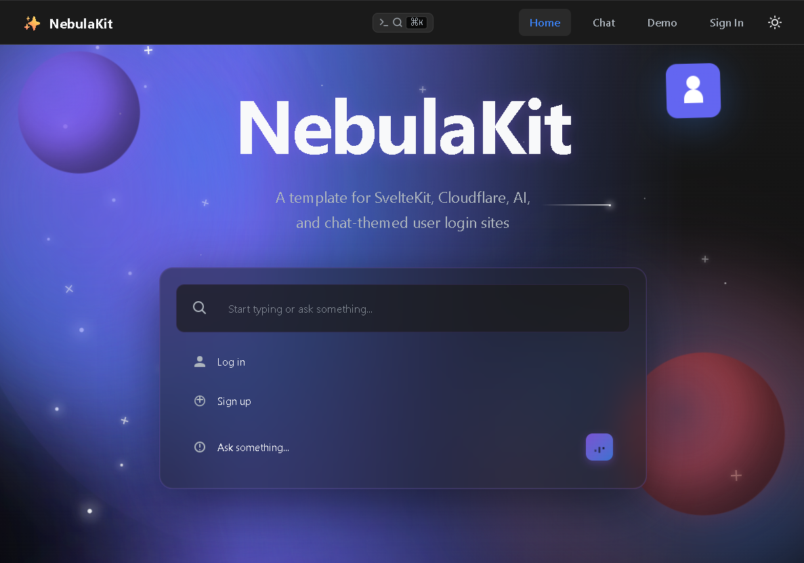

# ✨ Sortalizer

> A cosmic-grade SvelteKit starter template powered by Cloudflare's full stack

[](https://kit.svelte.dev/)
[](https://www.cloudflare.com/)

Sortalizer is a production-ready SvelteKit template with everything you need to
build modern web applications. It comes with Cloudflare Workers integration (D1,
KV, R2, Queues, Turnstile), a complete theme system, command palette, LLM chat
UI, full authentication, and polished drag-and-drop—all built in from day one.

## 🌟 Features

- **🚀 Cloudflare Full Stack**: D1 database, KV storage, R2 buckets, Queues, and
  Turnstile built-in
- **🎨 Theme System**: Light/dark modes with extensible CSS variables
- **⌨️ Command Palette**: Keyboard-first navigation (Cmd/Ctrl + K)
- **💬 LLM Chat UI**: Ready-to-use chat interface for AI integration
- **🔐 Full Authentication**: Email/password + SSO (Google, GitHub) with account
  linking
- **📱 Mobile-First**: Responsive layouts optimized for all devices
- **🎯 Drag & Drop**: Polished DnD with cross-column and mobile support
- **⚡ TypeScript**: Full type safety with Cloudflare Workers types
- **🎨 UI Components**: Beautiful, accessible components out of the box

## 🚀 Quick Start

```bash
# Install dependencies
npm install

# Start development server
npm run dev

# Build for production
npm run build

# Deploy to Cloudflare Pages
npm run deploy
```

Visit `http://localhost:5173` to see your app!

## 🧪 Testing (TDD Required!)

Sortalizer follows **Test-Driven Development** with 90%+ code coverage
requirements:

```bash
# Run all tests
npm run test

# Run tests in watch mode
npm run test:watch

# Check coverage (must be ≥90%)
npm run test:coverage

# Run E2E tests
npm run test:e2e

# Run all tests (unit + E2E)
npm run test:all
```

**Important**: All features and bug fixes require tests written FIRST. See
[CONTRIBUTING.md](./CONTRIBUTING.md) for details.

## 📚 Documentation

- [Setup Guide](./SETUP.md) - Complete installation and configuration
  instructions
- [Features](./FEATURES.md) - Detailed feature documentation and usage examples
- [Contributing Guide](./CONTRIBUTING.md) - Development workflow and testing
  standards
- [Theme System Guide](./docs/THEME_SYSTEM.md) - Comprehensive theming and
  accessibility guide
- [GitHub Copilot Instructions](.github/copilot-instructions.md) - AI-assisted
  development guidelines

## 🏗️ Project Structure

```
Sortalizer/
├── src/
│   ├── lib/
│   │   ├── components/     # Reusable UI components
│   │   ├── stores/         # Svelte stores (theme, etc.)
│   │   ├── server/         # Server-side utilities
│   │   └── utils/          # Helper functions
│   ├── routes/             # SvelteKit routes
│   │   ├── auth/          # Authentication pages
│   │   ├── chat/          # LLM chat interface
│   │   └── demo/          # Feature demonstrations
│   ├── app.css            # Global styles & theme
│   └── app.html           # HTML template
├── static/                 # Static assets
└── wrangler.toml          # Cloudflare configuration
```

## 🎨 Theming

Sortalizer includes a comprehensive theme system with:

- ✅ **WCAG AA compliant** colors (4.5:1 contrast minimum)
- 🌓 Light and dark modes with automatic system detection
- 🎨 CSS custom properties for all design tokens
- ♿ Accessibility-first design approach
- 🧪 Automated contrast validation

```css
/* All colors use CSS variables - never hardcode! */
.button {
	background-color: var(--color-primary);
	color: var(--color-background);
	border-radius: var(--radius-md);
	padding: var(--spacing-sm) var(--spacing-md);
}
```

**Validate theme contrast:**

```bash
npm run validate:contrast
```

See the [Theme System Guide](./docs/THEME_SYSTEM.md) for complete documentation.

## 🔐 Authentication

Built-in auth pages with support for:

- Email/password authentication
- OAuth providers (Google, GitHub)
- Session management
- Account linking

Easily extend with [@auth/sveltekit](https://authjs.dev/) for more providers.

## 💬 Chat UI

The included chat interface is ready to connect to your LLM API:

```typescript
// In /routes/chat/+page.svelte
async function sendMessage() {
	const response = await fetch("/api/chat", {
		method: "POST",
		body: JSON.stringify({ message: input }),
	});
	// Handle response
}
```

## ☁️ Cloudflare Integration

### D1 Database

```typescript
const result = await platform.env.DB.prepare(
	"SELECT * FROM users WHERE email = ?",
)
	.bind(email)
	.first();
```

### KV Storage

```typescript
await platform.env.KV.put("key", "value");
const value = await platform.env.KV.get("key");
```

### R2 Storage

```typescript
await platform.env.BUCKET.put("file.jpg", fileData);
const file = await platform.env.BUCKET.get("file.jpg");
```

### Queues

```typescript
await platform.env.QUEUE.send({ data: "message" });
```

## 🎯 Drag & Drop

The demo page includes a fully functional kanban board with:

- Desktop drag and drop
- Mobile touch support
- Cross-column dragging
- Smooth animations

## 📱 Mobile Support

Sortalizer is mobile-first with:

- Responsive breakpoints (640px, 768px, 1024px, 1280px)
- Touch-optimized interactions
- Mobile navigation menu
- Optimized bundle sizes

## 🛠️ Tech Stack

- [SvelteKit](https://kit.svelte.dev/) - Web framework
- [Cloudflare Workers](https://workers.cloudflare.com/) - Edge runtime
- [TypeScript](https://www.typescriptlang.org/) - Type safety
- [Vite](https://vitejs.dev/) - Build tool

## 📝 License

MIT License - feel free to use this template for any project!

## 🤝 Contributing

We welcome contributions! Please read our
[Contributing Guide](./CONTRIBUTING.md) first.

**Key requirements:**

- ✅ Test-Driven Development (TDD) - write tests first
- ✅ 90%+ code coverage on all changes
- ✅ Cloudflare-first architecture
- ✅ Minimal external dependencies
- ✅ All tests passing before PR

See [.github/copilot-instructions.md](.github/copilot-instructions.md) for
detailed development guidelines.

## ⭐ Show Your Support

If you find Sortalizer useful, please consider giving it a star on GitHub!
